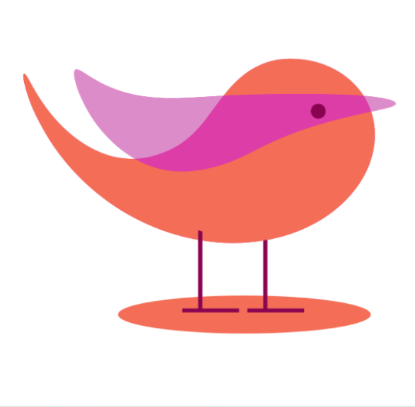

<div align="center">
    
    <h1>Pau</h1>
    
</div>

> Context: i made 14 languages and they all failed, so i decided to make a more bland/simpler one

```py
def main()
    println("Hello, world!");
end
```

Pau is a statically-typed, straightforward, experimental compiled programming language made in Rust. Pau is **NOT** a systems language nor a production-ready language. it is simply an experimental language that's made to be deliberately simple.

## Installing
```bash
cargo install --git https://github.com/tayenx3/pau.git

# confirm installation
pauc --version
```
(visit https://rustup.rs if you don't have Rust/`cargo` yet)

## How to compile using Pau
```bash
pauc main.pau -o main.exe
./main.exe
```

## Where to learn Pau?
idk man ur on ur own (for now)

## Why the name?
The name "Pau" comes from the Latin word "paulus" which means "small" or "not large"

## Goals and Roadmap
Pau is experimental, but still aims to have:
- Simple syntax
- Clear error messages
- Lean compilation

[More on the roadmap](ROADMAP.md)